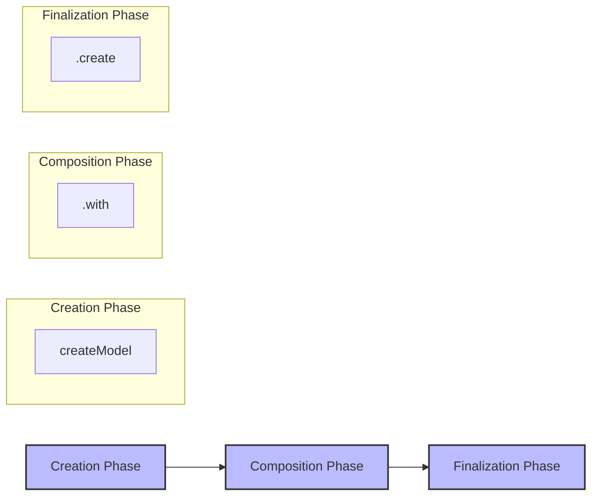

# Lattice

A **headless component framework** built on Zustand. Lattice lattices are both the declarative contract and the actual API for your component—defining, composing, and enforcing the API surface at both the type and runtime level.

## When to Use Lattice vs. Plain Hooks

| When plain hooks shine | Where they falter | How Lattice closes the gap |
| ---------------------------------------------- | ------------------------------------------------------------------------------------------------------ | --------------------------------------------------------------------------------------------- |
| Small, single‑purpose widget (e.g. accordion). | Complex components like **Tree View** that mix selection, drag‑and‑drop, type‑ahead, virtualisation. | Composable lattices encapsulate each behaviour through model composition; views merge safely. |
| One framework, one team. | **Cross‑framework** design‑system (React + Vue + Native). | Core is JSX‑free; models are framework-agnostic; adapters are thin wrappers. |
| WCAG handled by Radix/Headless UI façade. | Custom ARIA choreography across multiple behaviours (aria‑grabbed + aria‑selected + roving tab index). | Views are reactive composites, merged per UI part |
| Logic local to component. | Several products need to hot‑swap features (e.g. no DnD on mobile). | Features can be added/removed at instantiation, with granular reactivity throughout models. |

> TL;DR — Hooks remain perfect for simple widgets, but once you need **WCAG‑AA, composability, portability, and proper state isolation**, Lattice provides the missing middle layer.

## Core Value Propositions

- **Declarative Contract-as-API**: Every lattice is both the contract and the API, enforced at type and runtime.
- **Fluent Composition Pattern**: Chainable API with `.with()` and `.create()` methods for clear, expressive composition and finalization.
- **Type-Safe Composability**: All compositions are type-checked; contract violations are surfaced as type errors.
- **SAM Architecture**: Actions → Model → State → View, with strict separation of concerns.
- **Unified Model**: Getters and mutations in a single Model object with auto-generated hooks.
- **Factory Pattern**: Factories define reusable patterns, only instantiating stores when needed.
- **Instance Isolation**: Multiple independent instances with proper state isolation.
- **Zustand Foundation**: Familiar DX, dev-tools time-travel, no custom state engine.

## Mental Model & Flow


- **One-way data flow**: Follows the SAM (State-Action-Model) pattern.
- **Actions**: Pure intent (WHAT), triggering state changes via the model.
- **Model**: Contains business logic and state (HOW); the contract source-of-truth.
- **State**: Read-only selectors, forming the public API surface.
- **View**: Pure, reactive mappings from state/actions to UI attributes.
- **Lattice**: Exposes models, actions, state, and views for composition, while only exposing state and views for consuming.
- **Contract Enforcement**: Every composition or extension is type-checked; contract violations are surfaced as type errors.

## Public vs Internal APIs


- Only the derived **State** and **View(s)** are available via the Public API for consumption (e.g., by UI components).
- **Models** and **actions** are available for composition—when building new lattices or extensions—but are not exposed to consumers directly.
- Composing lattices together allows _composition_ of every part, but always through explicit contract selection and extension.
- **Models** are the source-of-truth, combining state and behavior, but are never exposed directly to consumers.
- The contract is preserved and enforced at every composition boundary.

## Glossary

| Terminology | Meaning |
| ----------- | ------- |
| **Model** | The primary unit of composition, containing state and business logic. Defines the contract for state and mutations. |
| **Actions** | Pure intent functions representing user operations (WHAT), delegating to model methods (HOW). |
| **State** | Public selectors providing read access to the model, forming part of the contract/API surface. |
| **View** | Pure, reactive representations that transform state and actions into ready-to-spread UI attributes. |

> Together, these make up a composable **lattice**—the declarative contract and the actual API for your component.

## Fluent Composition Pattern



Lattice's core compositional mechanism is a fluent composition pattern, used for models, states, actions, and views. This pattern consists of three distinct phases:

1. **Creation Phase**: Factory functions like `createModel()` and `createState()` create base model instances that serve as the starting point for composition.

2. **Composition Phase**: The `.with()` method extends the model by adding new properties or behaviors, receiving helpers (like `get()`) for accessing the model's state. Can be chained multiple times to progressively enhance the model.

3. **Finalization Phase**: The `.create()` method marks the end of the composition phase for a specific lattice, preventing further changes within that lattice definition.

## Factory-Based Composition

Lattice uses a factory-based composition model with these phases:

1. **Composition Phase**: Factory functions create base models that can be extended with the `.with()` method
2. **Finalization Phase**: The `.create()` method finalizes a specific model composition
3. **Instantiation Phase**: The actual Zustand stores are only created when the lattice itself is instantiated for use

This separation enables:
- Type-safe contract enforcement across all compositions
- Clean separation between contract composition and logic extension
- Lazy, efficient instantiation of enhanced lattices

## Building Blocks

### Model – Primary Unit of Composition

Models are the fundamental building blocks in Lattice, encapsulating both state and business logic. They define the contract for state and mutations, and are available for composition when building new lattices or extensions.

### Actions – Pure Intent Functions

Actions are pure intent functions representing WHAT should happen, delegating to model methods (HOW). They are available for composition, but are not exposed to consumers—only to composers.

### State – Public Selectors

State selectors provide read access to the model and form part of the public API surface. State is available for both composition and consumption.

### View – Reactive UI Attributes

Views are pure, reactive representations that transform state and actions into ready-to-spread UI attributes. Views are available for both composition and consumption, typically namespaced within lattices.

## The Derive System

The `derive` function creates reactive subscriptions between models, states, and views:


It's important to understand the difference between composition and deriving:

1. **Composition** happens with the `.with()` method to extend an existing component
2. **Deriving** happens when creating reactive subscriptions to finalized models/states

## Lattice Composition Example

Here's a concise example of composing lattices together:

```typescript
// Create a base counter lattice
const createCoreLattice = () => {
  // Create model with state and behavior
  const model = createModel(({ set, get }) => ({
    count: 0,
    privateData: "sensitive",
    increment: () => set((state) => ({ count: state.count + 1 })),
    reset: () => set({ count: 0 }),
  })).create();

  // Create and return lattice
  return createLattice("core", {
    model,
    actions: createActions(({ mutate }) => ({
      increment: mutate(model, "increment"),
      reset: mutate(model, "reset"),
    })).create(),
    state: createState(({ derive }) => ({
      count: derive(model, "count"),
      // Note: privateData is not exposed in state
    })).create(),
    view: {
      counter: createView(({ derive }) => ({
        "data-count": derive(model, "count"),
      })).create()
    }
  });
};

// Create an enhanced lattice by composing with the base lattice
const createEnhancedLattice = (baseLattice) => {
  // Use .select() to cherry-pick specific properties while composing
  const selectedModel = baseLattice.model
    .select(({ count, increment }) => ({
      // Keep these properties
      count,
      // Rename increment to avoid collisions
      basicIncrement: increment,
      // privateData and reset are omitted by not including them
    }))
    .with(({ get, set }) => ({
      // Add new functionality using the selected subset
      incrementTwice: () => {
        get().basicIncrement(); // Using renamed method
        get().basicIncrement();
      },
      // Add new state
      doubledCount: () => get().count * 2,
    })).create();

  // Return a new lattice that composes with the base lattice
  return createLattice(
    "enhanced",
    withLattice(baseLattice)({
      model: selectedModel,
      actions: createActions(({ mutate }) => ({
        // Add new action that references the enhanced model
        incrementTwice: mutate(selectedModel, "incrementTwice"),
      })).create(),
      state: createState(({ derive }) => ({
        // Expose new derived state
        doubledCount: derive(selectedModel, "doubledCount"),
      })).create(),
    }),
  );
};

// Usage: Create lattices and compose them
const coreLattice = createCoreLattice();
const enhancedLattice = createEnhancedLattice(coreLattice);
```

This example demonstrates:
- Creating a base lattice with core functionality
- Using the `.select()` method to cherry-pick and rename specific properties during composition
- Composing a new lattice that extends the base lattice while maintaining contract control
- Preserving the contract while adding new functionality
- The fluent composition pattern with `.with()` and `.create()`

With `.select()`, you can:
- Include only the properties you need from the base model
- Rename properties to avoid naming conflicts
- Exclude sensitive or internal data
- Create a clean, focused API surface

## Licensing

MIT