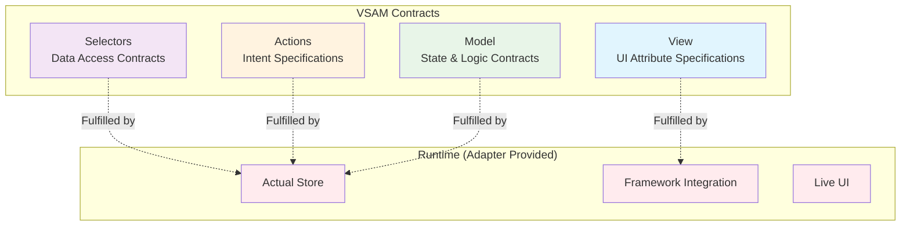
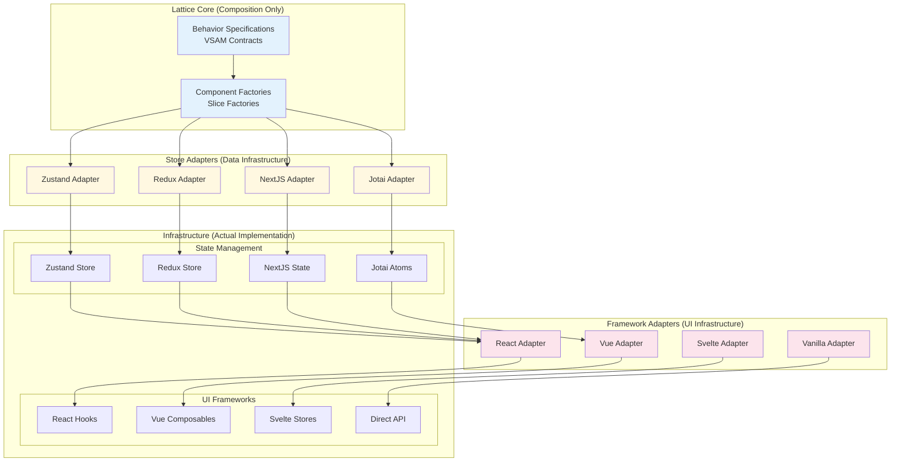
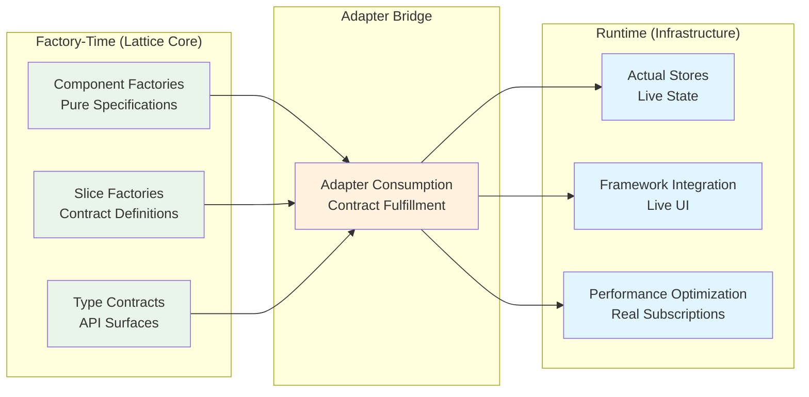
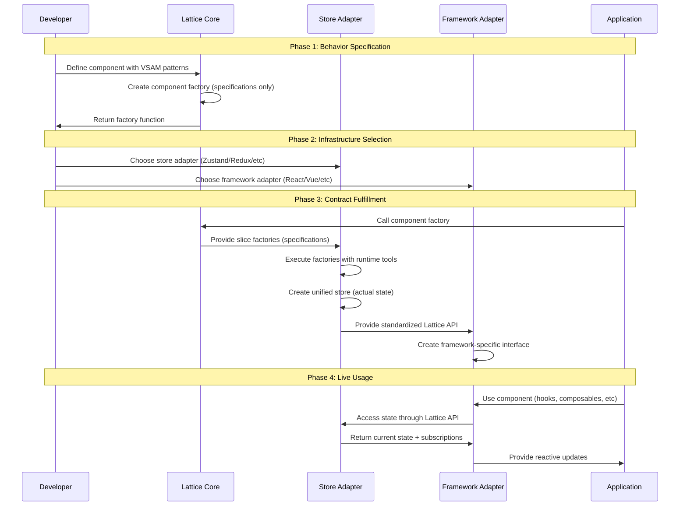

# Lattice Core Architecture

This document provides a comprehensive architectural overview of Lattice Core, a **compositional framework** for describing UI behavior and state contracts without implementing any actual state management.

## Overview

**Lattice Core is NOT a state management library.** It is a **composition layer** that provides a standardized framework for describing behavior specifications and exposing a unified API surface for accessing them. The actual state management is delegated to pluggable adapters.

### What Lattice IS

- **Behavior Description Framework**: Provides VSAM patterns for specifying component behavior
- **Type-Safe Composition API**: Enables composing complex behaviors from simple primitives  
- **Adapter Orchestration Layer**: Standardizes how behavior specifications interface with state systems
- **Cross-Platform Abstraction**: Same behavior works across any framework or state management system

### What Lattice IS NOT

- **State Management**: Never implements actual state storage, subscriptions, or persistence
- **UI Framework**: Never renders UI or manages DOM/virtual DOM
- **Data Fetching**: Never implements HTTP requests, caching, or server communication
- **Persistence Layer**: Never implements localStorage, databases, or storage mechanisms

## Core Principle: Behavior as Contracts

Lattice treats behavior as **executable contracts** - specifications that can be fulfilled by any compatible infrastructure:

```typescript
// Lattice provides the SPECIFICATION
const counterBehavior = createComponent(() => ({
  model: createModel(({ set, get }) => ({        // CONTRACT: "I need set/get tools"
    count: 0,
    increment: () => set(s => ({ count: s.count + 1 }))
  })),
  selectors: from(model).createSelectors(({ model }) => ({ // CONTRACT: "I need model access"
    count: model().count,
    doubled: model().count * 2
  })),
  actions: from(model).createActions(({ model }) => ({     // CONTRACT: "I need model access"
    increment: model().increment
  }))
}));

// Adapters FULFILL the contracts with actual infrastructure
const zustandFulfillment = zustandAdapter(counterBehavior);  // Zustand provides set/get
const reduxFulfillment = reduxAdapter(counterBehavior);      // Redux provides set/get
const jotaiFulfillment = jotaiAdapter(counterBehavior);      // Jotai provides set/get
```

## VSAM Architecture Pattern

Lattice introduces the **VSAM** (View-Selector-Action-Model) pattern for describing behavior contracts:



### VSAM Contract Definitions

| Component | Lattice Provides | Adapter Fulfills |
|-----------|------------------|------------------|
| **Model** | State structure & mutation contracts | Actual state storage (`set`, `get` tools) |
| **Selectors** | Data derivation specifications | State access & subscription mechanisms |
| **Actions** | Intent function signatures | Event handling & state mutation execution |
| **View** | UI attribute specifications | Framework-specific rendering & reactivity |

## Dual-Adapter Architecture

Lattice's power comes from separating **Store Adapters** (data infrastructure) from **Framework Adapters** (UI infrastructure):



### Store Adapters (Data Infrastructure)

Store adapters consume Lattice component factories and create actual stores:

```typescript
function createZustandStoreAdapter(componentFactory) {
  const sliceFactories = componentFactory(); // Get behavior specifications
  
  // Create actual Zustand store by executing slice factories with Zustand tools
  const store = createZustandStore((set, get) => ({
    model: sliceFactories.model({ set, get }),                    // Zustand provides set/get
    selectors: sliceFactories.selectors({ model: () => get().model }), // Bridge model access
    actions: sliceFactories.actions({ model: () => get().model }),     // Bridge model access
  }));
  
  // Return standardized Lattice API (framework-agnostic)
  return {
    getSelectors: () => store.getState().selectors,
    getActions: () => store.getState().actions,
    subscribe: store.subscribe,
    // ... standard Lattice interface
  };
}
```

**Store Adapter Responsibilities:**
- Execute slice factories with appropriate runtime tools (`set`, `get`)
- Create unified stores from separate slices
- Handle dependency injection (selectors/actions need model access)
- Provide standardized Lattice API for framework adapters

### Framework Adapters (UI Infrastructure)

Framework adapters consume the standardized Lattice API and create framework-specific interfaces:

```typescript
function createReactFrameworkAdapter(latticeAPI) {
  // Take ANY Lattice API (from any store adapter) and create React hooks
  return {
    useSelectors: (selector) => {
      return useSyncExternalStore(
        latticeAPI.subscribe,
        () => selector(latticeAPI.getSelectors())
      );
    },
    useActions: () => latticeAPI.getActions(),
    // ... React-specific implementations
  };
}
```

**Framework Adapter Responsibilities:**
- Consume standardized Lattice API from any store adapter
- Provide framework-specific interfaces (hooks, composables, etc.)
- Handle framework-specific reactivity and optimization
- Enable mix-and-match with any compatible store adapter

## Adapter Compatibility Matrix

The dual-adapter system enables mix-and-match compatibility:

```typescript
// Universal store adapters - work with any framework
export const zustandStore = createZustandStoreAdapter
  .with(reactAdapter, vueAdapter, svelteAdapter, vanillaAdapter);

export const reduxStore = createReduxStoreAdapter  
  .with(reactAdapter, vueAdapter, vanillaAdapter);

// Coupled store adapters - only work with specific frameworks
export const nextjsStore = createNextjsStoreAdapter
  .with(reactAdapter); // NextJS is React-only

export const nuxtStore = createNuxtStoreAdapter
  .with(vueAdapter); // Nuxt is Vue-only
```

**Usage Examples:**
```typescript
// Same behavior, different infrastructures
const behavior = createCounterComponent();

// Zustand + React
const counter1 = zustandStore(behavior).react();

// Zustand + Vue  
const counter2 = zustandStore(behavior).vue();

// Redux + React
const counter3 = reduxStore(behavior).react();

// NextJS + React (coupled)
const counter4 = nextjsStore(behavior).react(); // Only valid combination
```

## Factory-Time vs Runtime: The Composition Boundary

The critical distinction in Lattice is between **composition time** (behavior specification) and **runtime** (infrastructure fulfillment):



### Factory-Time: Pure Behavior Specification

At factory-time, Lattice creates **specifications** without any infrastructure:

```typescript
// Factory-time: ONLY specifications, no actual state
const componentFactory = createComponent(() => ({
  // These return FACTORY FUNCTIONS, not executed slices
  model: createModel(({ set, get }) => ({ ... })),        // Specification: "I need set/get"
  selectors: from(model).createSelectors(({ model }) => ({ ... })), // Specification: "I need model access"
  actions: from(model).createActions(({ model }) => ({ ... })),     // Specification: "I need model access"
}));
```

**Factory-Time Characteristics:**
- No actual state management happens
- No framework dependencies exist
- Only type-safe contracts and function signatures
- Completely infrastructure-agnostic
- Can be serialized, analyzed, or transformed

### Runtime: Infrastructure Fulfillment

At runtime, adapters **fulfill** the specifications with actual infrastructure:

```typescript
// Runtime: Adapters fulfill specifications with real infrastructure
const zustandAdapter = (componentFactory) => {
  const sliceFactories = componentFactory(); // Get specifications
  
  // Execute specifications with Zustand infrastructure
  const store = createZustandStore((set, get) => ({
    model: sliceFactories.model({ set, get }),           // Zustand fulfills set/get contract
    selectors: sliceFactories.selectors({ model: () => get().model }), // Zustand fulfills model access
    actions: sliceFactories.actions({ model: () => get().model }),     // Zustand fulfills model access
  }));
  
  return store; // Now we have ACTUAL state management
};
```

**Runtime Characteristics:**
- Actual state storage and subscription mechanisms
- Real performance optimizations and middleware
- Framework-specific reactivity and integration
- Live data and event handling

## Component Lifecycle: From Specification to Execution



## Benefits of the Compositional Approach

### For Component Authors
- **Pure Behavior Focus**: Define only logic, never infrastructure
- **Maximum Portability**: Same component works everywhere
- **Type Safety**: Full contracts prevent runtime errors
- **Testability**: Pure specifications are easily testable

### For Application Developers
- **Infrastructure Freedom**: Choose any state management + framework combination
- **Incremental Adoption**: Add Lattice components without changing existing architecture
- **Performance Control**: Select adapters optimized for specific needs
- **Ecosystem Access**: Full access to chosen infrastructure's tooling and middleware

### For the Ecosystem
- **Adapter Innovation**: New state management or frameworks can be integrated as adapters
- **Behavior Reuse**: Same behaviors work across different infrastructure choices
- **Gradual Migration**: Can migrate infrastructure without changing component logic
- **Community Growth**: Specialized adapters for domain-specific needs

## Key Insight: Composition Over Implementation

Lattice's fundamental innovation is treating UI behavior as **composable specifications** rather than **concrete implementations**. This enables:

- **Behavior Portability**: Write once, run anywhere
- **Infrastructure Evolution**: Adapt to new state management or framework technologies without changing component logic
- **Performance Optimization**: Choose optimal infrastructure per use case
- **Ecosystem Leverage**: Benefit from the full ecosystem of any chosen infrastructure

---

**Remember**: Lattice Core never implements state management, UI rendering, or data persistence. It provides the composition layer that makes these concerns pluggable and interchangeable while maintaining type safety and behavior consistency.